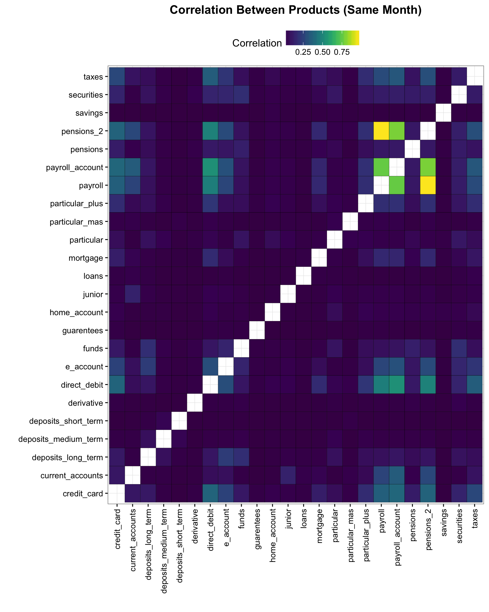

# Purchase Relationships

I'm curious how the products relate to eachother. I want to see the 
correlation between which products each customer owns in the same month.


```r
raw_data <- read_csv("~/Documents/Data/Kaggle_Comps/Santander/train_ver2.csv", col_types = col_types, progress = F)

cal_data <- raw_data %>%
  make_calibration %>%
  clean_names

product_cors <- cal_data %>%
  select(savings:direct_debit) %>%
  cor(use = "complete.obs")

product_cors %>% 
  data.frame %>% 
  mutate(Variable_1 = row.names(product_cors)) %>%
  gather(Variable_2, Correlation, -Variable_1) %>%
  filter(Variable_1 != Variable_2) %>%
  mutate(Correlation = abs(Correlation)) %>%
  ggplot(aes(x = Variable_1, y = Variable_2, fill = Correlation)) +
  geom_tile(color = "black") +
  viridis::scale_fill_viridis() +
  theme_mells +
  xlab("") +
  ylab("") +
  ggtitle("Correlation Between Products (Same Month)") +
  theme(axis.text.x = element_text(angle = 90, hjust = 1, vjust = .5),
        legend.position = "top")
```



But what I'm actually interested in is how having one product in a month
relates to having a product in the *next* month. 


```r
cal_data %>%
  arrange(customer_code, fetch_date) %>%
  head(100) %>%
  group_by(customer_code) %>%
  mutate(test = lag(credit_card)) %>% 
  select(customer_code, fetch_date, credit_card, test) %>% View

lagged_products <- cal_data %>%
  select(customer_code, fetch_date, savings:direct_debit) %>%
  arrange(customer_code, fetch_date) %>%
  mutate(id = 1:n()) %>%
  left_join(., mutate(., id = id + 1), by = c("id")) %>%
  filter(customer_code.x == customer_code.y)

names(lagged_products) <- str_replace_all(names(lagged_products), fixed(".x"), "") %>%
  str_replace_all(fixed(".y"), "_lagged")
  
lag_cor <- function(variable, df){
  cors <- cor(x = df[[variable]], y = select(df, savings_lagged:direct_debit_lagged), use = "complete.obs")
  data_frame(Product = variable, Lagged_Product = colnames(cors), Correlation = cors[1, ])
}

products <- cal_data %>%
  select(savings:direct_debit) %>%
  names

lagged_cors <- products %>%
  map(lag_cor, lagged_products) %>%
  bind_rows

lagged_cors %>%
  mutate(Correlation = abs(Correlation)) %>%
  ggplot(aes(x = Lagged_Product, y = Product, fill = Correlation)) +
  geom_tile(color = "black") +
  viridis::scale_fill_viridis() +
  theme_mells +
  xlab("") +
  ylab("") +
  ggtitle("Correlation Between Products (Previous Month)") +
  theme(axis.text.x = element_text(angle = 90, hjust = 1, vjust = .5),
        legend.position = "top")
```


Let's try that without the same variable


```r
lagged_cors %>%
  mutate(Correlation = abs(Correlation)) %>%
  filter(str_replace_all(Lagged_Product, "_lagged", "") != Product) %>%
  ggplot(aes(x = Lagged_Product, y = Product, fill = Correlation)) +
  geom_tile(color = "black") +
  viridis::scale_fill_viridis() +
  theme_mells +
  xlab("") +
  ylab("") +
  ggtitle("Correlation Between Products (Previous Month)\nSame Products Removed") +
  theme(axis.text.x = element_text(angle = 90, hjust = 1, vjust = .5),
        legend.position = "top")
```


